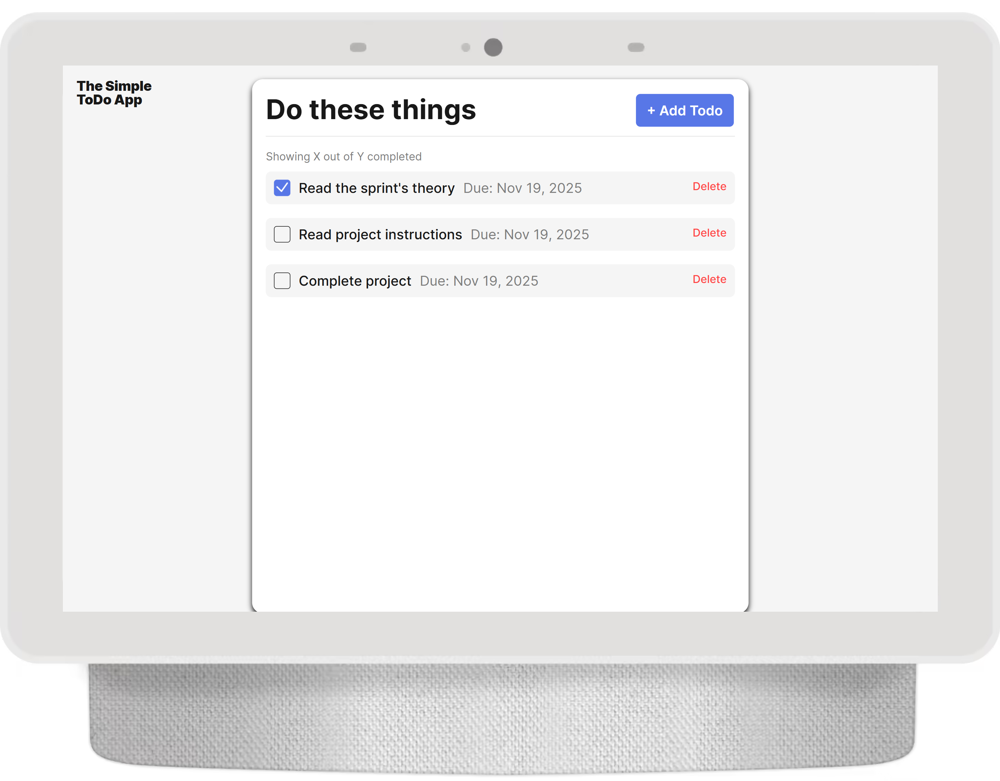

# Simple Todo App

A website for creating to-do lists.

## Functionality

The website lets you add things to your to-do list, remove them, cross them off, and assign due dates to them.

## Technology

The technologies that are used include:

- OOP
- JavaScript classes
- Modular JavaScript
- JavasCript imports and exports

## Deployment

This project is deployed on GitHub Pages:

- ADD LINK HERE

[GitHub Pages](https://rose-2357.github.io/se_project_todo-app/ "Link to GitHub Pages")
